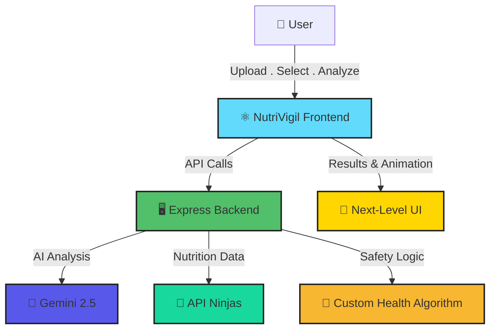

<!-- HEADER BANNER -->
<p align="center">
  
</p>

<p align="center">
  <a href="https://nutf.onrender.com" target="_blank">
    
  </a>
  
  
  
  
</p>

---

<p align="center" style="font-size:1.6em">
  <strong>🥗 NutriVigil: Snap. Analyze. Elevate Every Bite.</strong><br>
  <em>The AI-powered nutrition platform—smart, personalized, and beautifully fast.</em>
</p>

---

<div align="center">
  
  &nbsp;
  
</div>

---

## 🚀 Why NutriVigil?

<p align="center">
  
</p>

- 🤳 **AI-Powered Food Scan:** Instantly analyze any meal with cutting-edge Gemini v2.5 artificial intelligence.
- 🩺 **Personalized Health:** Your conditions, your guidelines—gluten-free, diabetes, hypertension, allergies, and more.
- 🚦 **Smart Safety Signals:** AI color-coding for instant “safe/red flag” nutrition advice.
- 🧬 **Decoded Nutrition:** Macros & micros visualized—transformed from data to clear insights.
- 🏆 **Actionable Wellness:** Smart tips, tracking goals, saving reports—NutriVigil helps guide wisdom, not just stats.
- ⚡ **Ultra-Responsive UI:** Seamless, animated, app-like experience—performance that's as healthy as your diet.

---

## 🛠️ Tech Power-Ups

| Frontend                   | Backend                      | Intelligence & Data         |
|:--------------------------:|:---------------------------:|:--------------------------:|
| ⚛️ React (Vite)            | 🖥️ Node.js + Express        | 🤖 Gemini AI v2.5 (Google) |
| 🎨 Tailwind + Animations   | 🗂️ Multer (Smart Uploads)   | 🥗 API Ninjas Nutrition    |
| 🗃️ Lucide + Custom SVGs    | 🚦 Advanced Safety Logic     | 🔒 Secure Axios Calls      |
| 🚀 PWA Capable             | 🧠 Context + History         | 🔔 Smart Notifications     |

---

## 🗺️ Intelligent Architecture



---

## 🌐 Project Structure

```shell
NutriVigil/
 ├─ frontend/      # React + Vite + Tailwind (Animated UI)
 ├─ backend/       # Node.js + Express + Multer (REST/AI)
 └─ README.md
```

---

## ⚡ Quickstart

```bash
# 1. Clone the repo
git clone https://github.com/<your-username>/NutriVigil.git && cd NutriVigil

# 2. Install dependencies
cd frontend && npm i
cd ../backend && npm i

# 3. Add your API keys in backend/.env (see backend/.env.example)

# 4. Start development servers
cd frontend && npm run dev
cd ../backend && npm run dev
```

---

## 🔑 API Keys Needed

- **Gemini API Key:** [Google AI Studio](https://makersuite.google.com/app/apikey)
- **API Ninjas Key:** [API Ninjas Nutrition](https://api-ninjas.com/api/nutrition)

---


## ✨ Features

- 📸 Snap or upload food images—AI-powered ingredient & nutrition detection.
- 🏷️ Personal health profile (diabetes, allergies, hypertension, and more).
- 🚦 AI-powered safety traffic light (color + advice).
- 📊 Nutrient breakdown with easy visual summaries.
- 📝 Personalized recommendations, goals, and smart reporting.
- ⚡ App-level speed and animation—100% responsive.

---

## 🧰 Tech Stack

**Backend:**
- Node.js + Express
- Multer (file uploads)
- Gemini AI (food analysis)
- API Ninjas (nutrition database)
- Axios

**Frontend:**
- React
- Vite
- Tailwind CSS + Animations
- Lucide React + SVGs
- PWA-ready, responsive

---

## 🚨 Disclaimer

_NutriVigil provides AI-generated health guidance and nutrition facts for informational purposes. Always check with certified health professionals before making major dietary changes._

---
````
